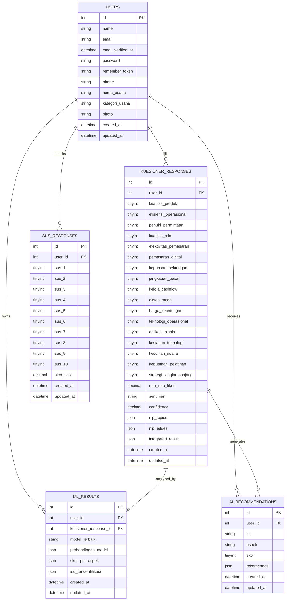
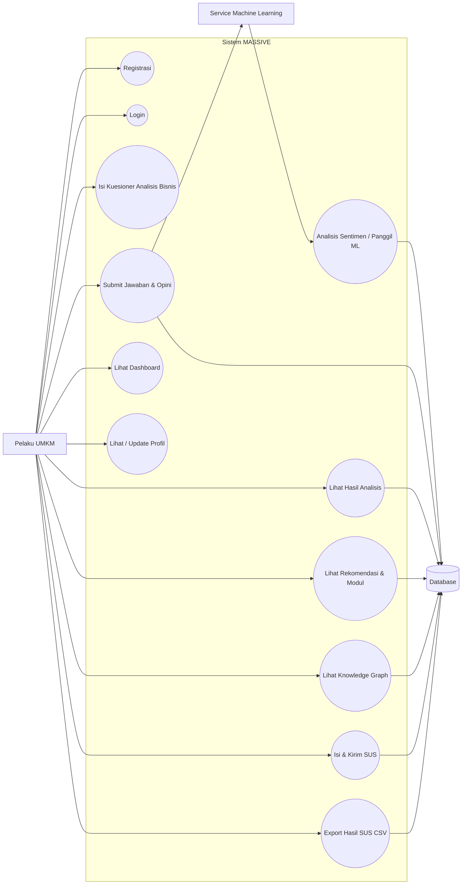

# ERD and Use Case Review

This note captures the differences between the attached diagrams and the current codebase in MASSIVE.

## ERD Differences

### `users`

The diagram shows only `id`, `name`, `phone`, `email`, `photo`, `created_at`, and `updated_at`.

The code actually uses these columns:

- `id`
- `name`
- `email`
- `email_verified_at`
- `password`
- `remember_token`
- `phone`
- `nama_usaha`
- `kategori_usaha`
- `photo`
- `created_at`
- `updated_at`

### `kuesioner_responses`

The diagram is incomplete. The current table has many more fields:

- `user_id`
- `kualitas_produk`
- `efisiensi_operasional`
- `penuhi_permintaan`
- `kualitas_sdm`
- `efektivitas_pemasaran`
- `pemasaran_digital`
- `kepuasan_pelanggan`
- `jangkauan_pasar`
- `kelola_cashflow`
- `akses_modal`
- `harga_keuntungan`
- `teknologi_operasional`
- `aplikasi_bisnis`
- `kesiapan_teknologi`
- `kesulitan_usaha`
- `kebutuhan_pelatihan`
- `strategi_jangka_panjang`
- `rata_rata_likert`
- `sentimen`
- `confidence`
- `opini_*` columns for each survey item
- `nlp_topics`
- `nlp_edges`
- `integrated_result`
- `created_at`
- `updated_at`

### `ml_results`

The relation is correct, but the diagram should show the full current structure:

- `user_id`
- `kuesioner_response_id`
- `model_terbaik`
- `perbandingan_model`
- `skor_per_aspek`
- `isu_teridentifikasi`
- `created_at`
- `updated_at`

### `ai_recommendations`

This table exists in code and should be included in the ERD:

- `user_id`
- `isu`
- `aspek`
- `skor`
- `rekomendasi`
- `created_at`
- `updated_at`

### `sus_responses`

This table exists in code and should also be included in the ERD:

- `user_id`
- `sus_1` to `sus_10`
- `skor_sus`
- `created_at`
- `updated_at`

### `modules`

The database migration and dump contain a `modules` table, but the application currently reads module content from `config/modules.php`, not from the database table. So for the active ERD, treat `modules` as a static config source, not a relational entity.

## Current Relationships

- `users` 1..\* `kuesioner_responses`
- `users` 1..\* `ml_results`
- `users` 1..\* `ai_recommendations`
- `users` 1..\* `sus_responses`
- `kuesioner_responses` 1..1 `ml_results`
- `kuesioner_responses` 1..\* `ai_recommendations`

## Use Case Differences

### Correct user-facing flows

- Registrasi
- Login
- Isi Kuesioner Analisis Bisnis
- Submit Jawaban & Opini
- Lihat Dashboard
- Lihat / Update Profil
- Lihat Hasil Analisis
- Lihat Rekomendasi & Modul
- Lihat Knowledge Graph
- Isi & Kirim SUS
- Export Hasil SUS CSV

### External system

- The external ML service is Flask, called through `/ml/predict` and the app config `FLASK_ML_URL`.

### Important flow detail

- SUS is not a separate step inside the questionnaire form.
- It is shown after the questionnaire is submitted, from the dashboard flow, using the `show_sus` session flag and the dashboard modal logic.

## Suggested Updated ERD Summary

## Suggested Updated Use Case Summary

## Files Used For Review

- [app/Http/Controllers/KuesionerController.php](../app/Http/Controllers/KuesionerController.php)
- [app/Http/Controllers/DashboardController.php](../app/Http/Controllers/DashboardController.php)
- [app/Http/Controllers/ModulController.php](../app/Http/Controllers/ModulController.php)
- [app/Http/Controllers/RekomendasiController.php](../app/Http/Controllers/RekomendasiController.php)
- [routes/web.php](../routes/web.php)
- [routes/api.php](../routes/api.php)
- [database/migrations/0001_01_01_000000_create_users_table.php](../database/migrations/0001_01_01_000000_create_users_table.php)
- [database/migrations/2024_01_01_000001_create_kuesioner_responses_table.php](../database/migrations/2024_01_01_000001_create_kuesioner_responses_table.php)
- [database/migrations/2024_01_01_000003_create_ml_results_table.php](../database/migrations/2024_01_01_000003_create_ml_results_table.php)
- [database/migrations/2024_01_01_000004_create_ai_recommendations_table.php](../database/migrations/2024_01_01_000004_create_ai_recommendations_table.php)
- [database/migrations/2024_01_01_000006_create_sus_responses_table.php](../database/migrations/2024_01_01_000006_create_sus_responses_table.php)
- [config/modules.php](../config/modules.php)
